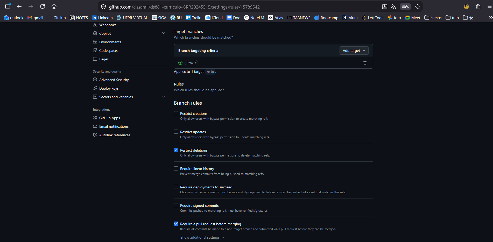

# Currículo Profissional - DS881

Este projeto contém meu currículo profissional desenvolvido com Astro, conteinerizado com Docker e publicado via GitHub Actions.

##  Link do Projeto
 [https://seu-usuario.github.io/ds881-curriculo-GRR20245515/](https://cissamil.github.io/ds881-curriculo-GRR20245515/)

##  Como Executar Localmente (Docker)

Certifique-se de ter o Docker instalado. No terminal, execute:

```bash
docker-compose up --build
```

O site estará disponível em `http://localhost:8080`.

##  Governança e Branch Protection
A branch `main` está configurada para:
1. Exigir Pull Request antes do merge.
2. Exigir que os status checks (CI/CD) passem com sucesso.



##  Tecnologias
- Astro
- Docker
- GitHub Actions


